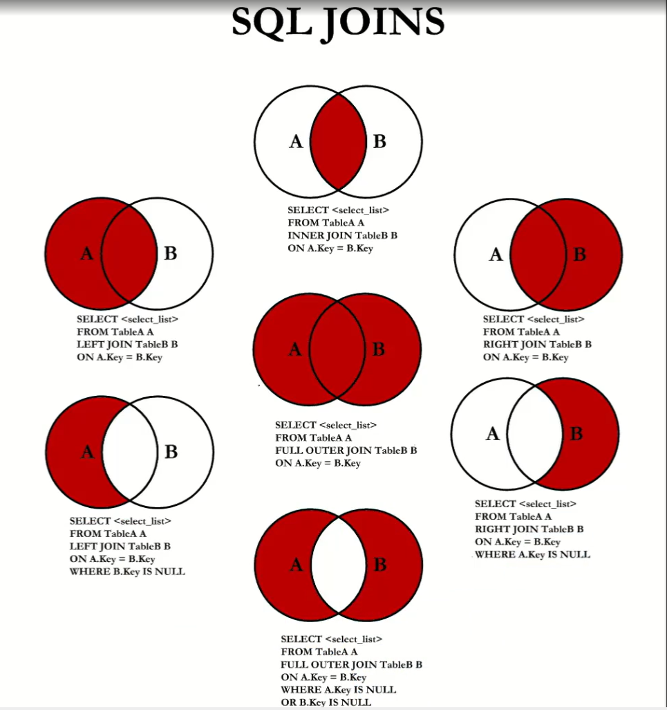

# Сложные `SELECT` запросы.

## Вложенные `SELECT` запросы

## Объединения `JOIN`

## Объединения (`CROSS JOIN`, `INNER JOIN`)

## Объединения (`LEFT JOIN`, `RIGHT JOIN`)

## Объединения (`FULL OUTER JOIN`)

## Подзапросы или объединения?

## Соединения (`UNION`)

## Оконные функции

## Общие табличные выражения

## Рекурсивные табличные выражения