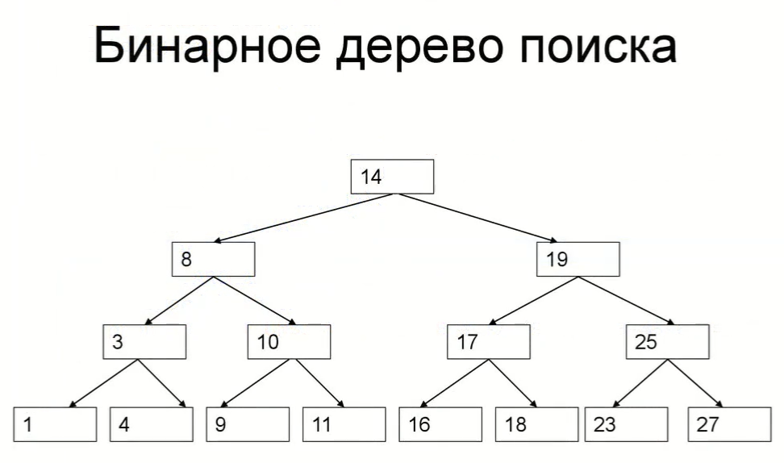

# Проектирование

## 1. Занятие

**DDL** - data definition language. Такие команды, как:

* `CREATE` - создать бд, таблицу в бд, представление и т.д.
* `DELETE` - удалить объект(представление, таблицу, процедуру и т.д.)
* `ALTER` - изменить существующий объект тем или иным способом

## 2 Занятие. Особенности типов данных.

* `CHAR(n)` - фиксированная длина n и `VARCHAR(n)` - финксированная длина до n
* `UNIQUE` и `PRIMARY KEY` задают ограничение.

* `PRIMARY KEY` создает кластеризованный индекс, а `UNIQUE` некластеризованный.
* индекс называется кластеризованным, если в его листьях находятся значения в поле таблицы.
* если листья только указывают на нужную строку в таблице(создается отдельная структура данных, которая содержит ссылки
  на строки таблицы), тогда индекс некластеризованный.

## 3 Занятие. Пример работы индекса:

Бинарное дерево поиска состоит из:

* **Корень** - самый верхний элемент.
* **Листья** - самые нижние элементы.
* **Ветки** - все остальное посередине.

Допустим, мы хотим найти число 18 в дерево, то алгоритм работает следующим образом:

* Корень сравнивается со значением, значение 18 > 14, значит идем в правую вершину дерева.
* 19 > 18, значит идем в левую вершину дерева.
* 18 > 17, значит идем в правую вершину дерева.

* То есть на обход по дереву поиска понадобилось меньше времени. Алгоритм работает за логарифмическое время.
* Сбалансированное дерево - это дерево, в котором доступ ко всем листьям осуществляется за одинаковое количество шагов.
* Индексы ускоряют только чтение данных, а изменение данных индекс замедляет(при изменении данных его нужно будет
  постоянно перестраивать).
* Вывод: индекс нужно использовать только тогда, когда данные в большинстве случаев читаются.

## 4 Занятие. Внешние ключи:

Для связи между таблицами в реляционных базах данных есть три варианты отношений: **один к одному**, **один ко многим**,
**многие ко многим**

* `ON DELETE`(по умолчанию `RESCTRICT`) и `ON UPDATE`(по
  умолчанию `CASCADE`): `CASCADE`, `RESTRICT`, `SET NULL`, `SET DEFAULT`.
* `CASCADE` - автоматическое обновление записи.
* `RESCTIRCT` - запрет.
* `SET NULL` - ставится `NULL`.
* `SET DEFAULT` - ставится дефолтное значение.